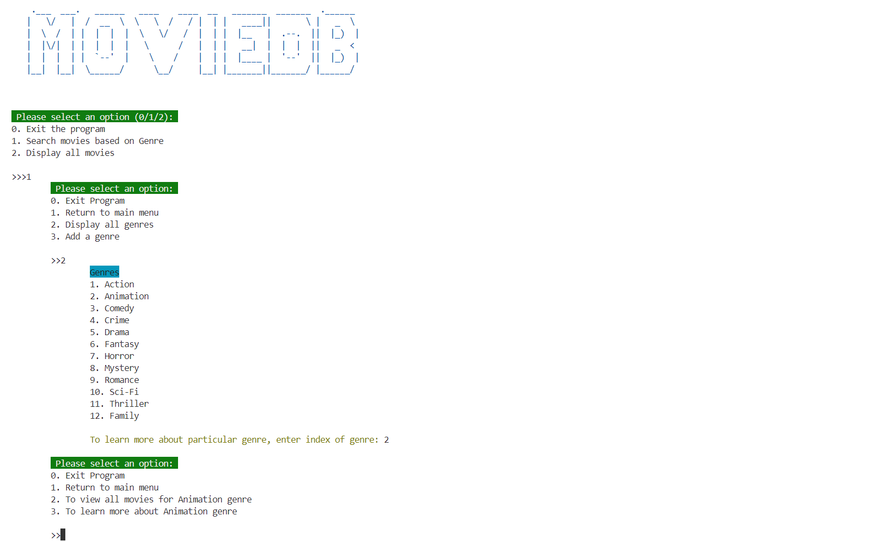

# README.md

## Project Overview

This CLI application allows users to manage movies and genres. Users can add, update, delete, and view movies and genres through a simple command-line interface. Below is a detailed description of the project's structure and functionality.

## File Structure
CATEGORY-MOVIE-CLI/  
&nbsp;&nbsp;├── lib/  
&nbsp;&nbsp;&nbsp;&nbsp;├── models/  
&nbsp;&nbsp;&nbsp;&nbsp;&nbsp;&nbsp;├── __init__.py  
&nbsp;&nbsp;&nbsp;&nbsp;&nbsp;&nbsp;├── movie.py  
&nbsp;&nbsp;&nbsp;&nbsp;&nbsp;&nbsp;├── genre.py  
&nbsp;&nbsp;&nbsp;&nbsp;├── cli.py  
&nbsp;&nbsp;&nbsp;&nbsp;├── genre_helpers.py  
&nbsp;&nbsp;&nbsp;&nbsp;├── movie_helpers.py  
&nbsp;&nbsp;&nbsp;&nbsp;├── seed.py  

    
#### `cli.py`

This is the main script to run the CLI application. It provides a user interface for interacting with the system, allowing users to manage genres, search movies, and exit the program.

- **main()**: Displays the main menu and handles user input for navigating the application. Users can select options to manage genres, movies, or exit the program.
- **menu()**: Displays the main menu options for the user.

#### `movie.py`

This file defines the `Movie` class and includes methods for interacting with movie data stored in the database.

- **Movie**: Represents a movie with attributes like name, release year, description, and genre ID.
  - **__init__()**: Initializes a new `Movie` instance.
  - **__repr__()**: Returns a string representation of the `Movie` instance.
  - **create_table()**: Creates a table for storing movie data.
  - **drop_table()**: Drops the movie table.
  - **save()**: Saves a `Movie` instance to the database.
  - **create()**: Creates and saves a new `Movie` instance.
  - **instance_from_db()**: Creates a `Movie` instance from a database row.
  - **get_all()**: Retrieves all movies from the database.
  - **delete()**: Deletes a `Movie` from the database.
  - **update()**: Updates a `Movie` in the database.

#### `genre.py`

This file defines the `Genre` class and includes methods for interacting with genre data stored in the database.

- **Genre**: Represents a genre with attributes like name, description, and creation date.
  - **__init__()**: Initializes a new `Genre` instance.
  - **__repr__()**: Returns a string representation of the `Genre` instance.
  - **create_table()**: Creates a table for storing genre data.
  - **drop_table()**: Drops the genre table.
  - **save()**: Saves a `Genre` instance to the database.
  - **create()**: Creates and saves a new `Genre` instance.
  - **instance_from_db()**: Creates a `Genre` instance from a database row.
  - **get_all()**: Retrieves all genres from the database.
  - **movies()**: Retrieves all movies associated with the genre.
  - **delete()**: Deletes a `Genre` from the database.
  - **update()**: Updates a `Genre` in the database.

#### `genre_helpers.py`

This script provides various helper functions for managing genres and their associated movies.

- **handle_genres()**: Main entry point for genre-related operations. Displays a menu and handles user input.
- **display_all_genres()**: Retrieves and displays all genres from the database.
- **display_all_movies()**: Displays all movies for the currently selected genre.
- **selected_genre_handler()**: Handles operations specific to a selected genre.
- **genre_movie_handler(movies)**: Handles movie-related operations within a genre.
- **update_movie()**: Updates the details of a selected movie.
- **delete_movie()**: Deletes a selected movie from the database.
- **add_movie(movies)**: Adds a new movie to the currently selected genre.
- **add_genre()**: Adds a new genre to the database.
- **genre_movie_menu()**: Displays a menu for movie-related operations within a genre.
- **genre_menu(genre_id)**: Displays a menu for genre-related operations.
- **menu()**: Displays the main menu for genre operations.
- **exit_program()**: Exits the program with a goodbye message.

#### `movie_helpers.py`

This script provides various helper functions for managing movies and their associated genres.

- **display_all_movies()**: Retrieves and displays all movies from the database.
- **add_movie()**: Prompts the user to enter movie details and adds the movie to the database.
- **delete_movie()**: Prompts the user to enter the ID of the movie to delete and removes it from the database.
- **update_movie()**: Prompts the user to enter the ID of the movie to update and modifies its details in the database.
- **find_all_by_movie_name()**: Searches for movies by name and displays the results.
- **movie_main()**: Main entry point for movie-related operations. Displays a menu and handles user input.
- **menu()**: Displays the main menu for movie operations.
- **exit_program()**: Exits the program with a goodbye message.

#### `__init__.py`

Initializes the SQLite database connection.

- Establishes connection to the SQLite database and sets up the cursor for executing SQL commands.

#### `seed.py`

Seeds the database with initial data using the Faker library.

- Populates the database with predefined genres and randomly generated movies for testing and demonstration purposes.

### Screenshots and Resources

- [Pyfiglet Documentation](https://github.com/pwaller/pyfiglet)
- [Colorama Documentation](https://pypi.org/project/colorama/)

### How to Run

1. Ensure you have Python installed.
2. Install the required packages using `pipenv install`.
3. Create Python Shell `pipenv shell`
3. Run the application using `python /lib/cli.py`.

