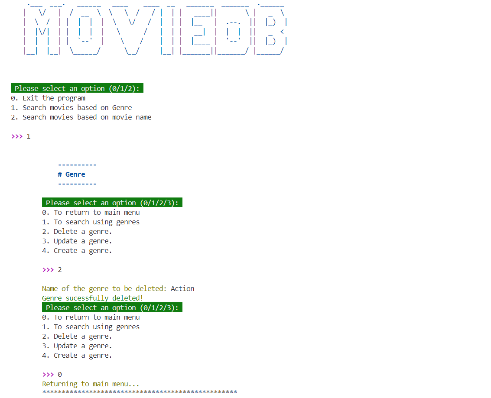

# MovieDB CLI Project

This project is a command-line interface (CLI) application for managing a movie database. It allows users to perform various operations related to genres and movies, such as creating, updating, deleting, and searching. Below, you'll find descriptions of the key files and functions within this project.

### Screenshot


## CLI Script: `cli.py`

The `cli.py` script is the main entry point for the MovieDB application. It presents a user-friendly menu system that allows users to navigate through different options for managing genres and movies. The script uses the `pyfiglet` library for stylized text and the `colorama` library for colorful terminal output.

### Main Functions

- `main()`: Initializes the CLI, displays the welcome message, and continuously displays the main menu until the user exits.
- `menu()`: Displays the main menu options for the user to choose from.
- `show_genre_menu()`: Displays the genre-specific options.
- `show_movie_menu()`: Displays the movie-specific options.

### Running the CLI

To run the CLI, you can use one of the following commands:

```console
python lib/cli.py
```
or

```console
./lib/cli.py
```
Make sure the lib/cli.py file has execute permissions if you are using the second method. You can add execute permissions with the following command:

```console
chmod +x lib/cli.py
```

## Genre Helpers: `genre_helpers.py`

This file contains helper functions for managing genres in the MovieDB application.

### Functions

- `display_all_genres()`: Retrieves and displays all genres from the database.
- `display_selected_genre()`: Allows the user to select a genre and displays movies associated with the selected genre, sorted by year or name.
- `delete_genre()`: Prompts the user to delete a genre by name.
- `update_genre()`: Prompts the user to update details of an existing genre.
- `create_genre()`: Prompts the user to create a new genre with a name, description, and creation date.

## Movie Helpers: `movie_helpers.py`

This file contains helper functions for managing movies in the MovieDB application.

### Functions

- `find_all_by_movie_name(movie_name)`: Finds and displays all movies by the given name.
- `add_new_movie()`: Prompts the user to add a new movie with details such as name, release year, description, and genre.
- `delete_movie()`: Prompts the user to delete a movie by name.
- `update_movie()`: Prompts the user to update details of an existing movie.
- `search_by_AZ()`: Allows the user to search for movies by the first letter of their name.
- `exit_program()`: Exits the CLI program.

## Debugging Script: `debug.py`

This script is used for debugging purposes. It resets the database and populates it with sample data for testing.

### Functions

- `reset_database()`: Resets the database by dropping and recreating the Genre and Movie tables, and populates them with sample data.
- `ipdb.set_trace()`: Starts an interactive debugger session.

## Seeding Script: `seed.py`

This script is used to seed the database with random data using the `Faker` library.

### Functions

- `generate_movie_name()`: Generates a random movie name.
- `generate_random_year(start_year, end_year)`: Generates a random year between `start_year` and `end_year`.
- `generate_movie_description()`: Generates a random movie description.
- `generate_random_genre()`: Generates a random genre.
- `main()`: Main function to reset and seed the database with random genres and movies.

## Models

### Genre Model

The `Genre` model represents a genre in the MovieDB application. It includes methods for creating, finding, updating, and deleting genres.

### Movie Model

The `Movie` model represents a movie in the MovieDB application. It includes methods for creating, finding, updating, and deleting movies.

## Generating Your Environment

You might have noticed in the file structure- there's already a Pipfile!

Install any additional dependencies you know you'll need for your project by
adding them to the `Pipfile`. Then run the commands:

```console
pipenv install
pipenv shell
```

## Resources

- [Faker Documentation](https://faker.readthedocs.io/en/master/)
- [Tabulate Documentation](https://pypi.org/project/tabulate/)
- [Colorama Documentation](https://pypi.org/project/colorama/)
- [Pyfiglet Documentation](https://github.com/pwaller/pyfiglet)


